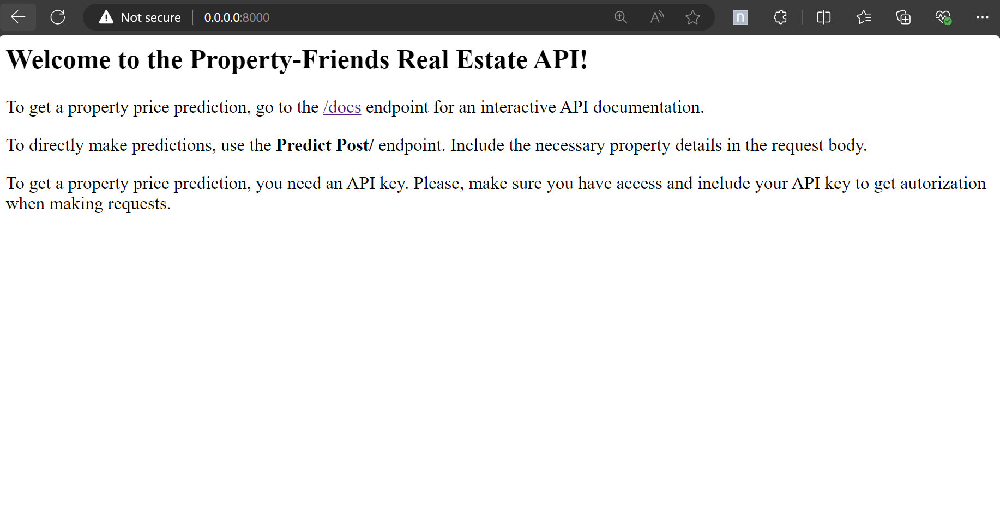
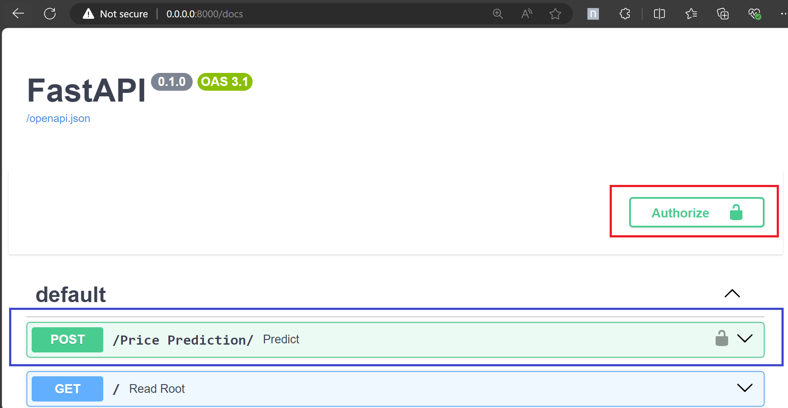
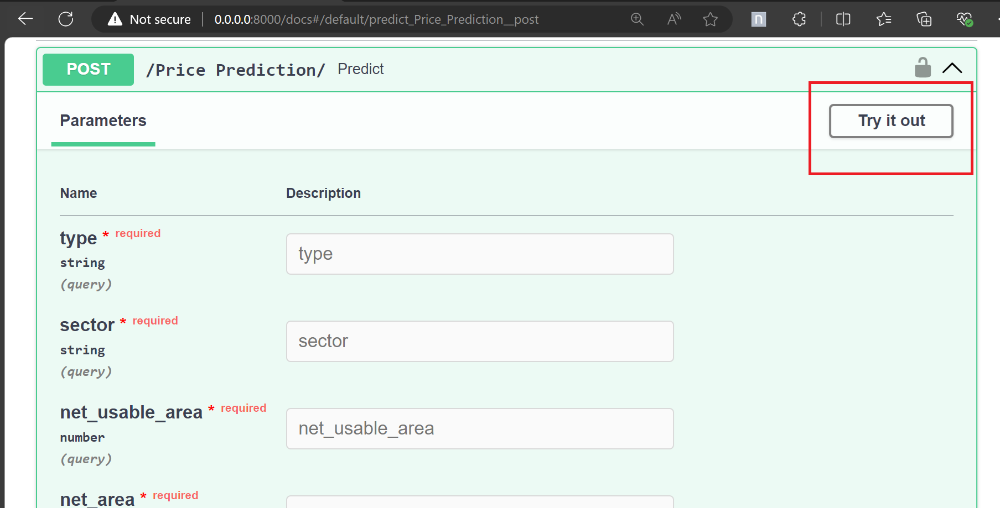
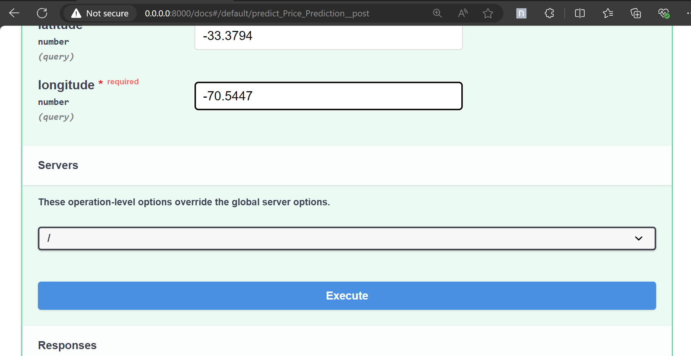
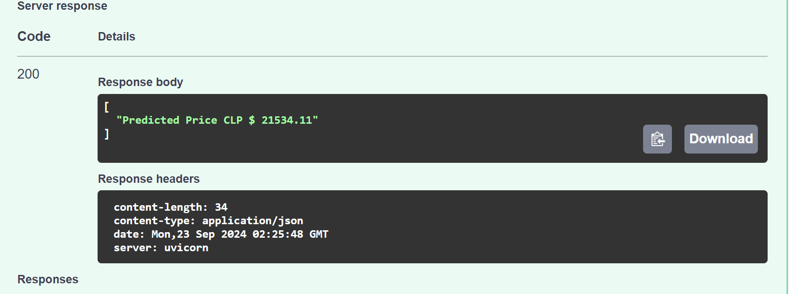

# Property-Friends Real State case

This project provides the pipeline and API deployment of a machine learning model for predicting property prices in Chile. Using Docker, FastAPI and scikt-learn. 

For more details on the project, check the `Challenge.md` file.

**Author:** Caroline Barbosa
## Overview

1. **API Development**: Build an API that receives property information and generates accurate valuation predictions using FastAPI.
2. **Model Pipeline**: Develop a well-structured pipeline that trains and evaluates the model using the provided dataset.
3. **Logging**: Implement logs for API calls and predictions.
4. **Docker**: Use Docker compose to containeraze the API.
5. **Security**: Use an API key for security purposes.
6. **Data Loading Abstraction**: Abstraction for data loading for future improvements.


## Assumptions
- It was assumed that the model was trained on the provided datasets (`train.csv`, `test.csv`) before being deployed. In the future, the data could be accessed directly from a database.
- The data processing and feature engineering is considered from the original pipeline provided on the notebook.
- The initial model is not optimal, but it serves as a foundation for quick deliver. It is assumed that the model provides a satisfatory result for the client. 
- The pipeline does not consider retraining of the model nor real-time data. 
- The basic api key implementation was assumed as a good enough approach for security.
- The log was considered only on the higher level for model setup, training and predictions. 

## Dependencies
Docker and docker-compose installed.

## Project Structure
   ```bash

challengeMLE>/
│
├── app.py                   # Main FastAPI application file
│
├── config_files/           # Directory for configuration files (both prediction model and api)
│
├── data/                    # Directory for datasets (should include sensitive data for training and evaluating the model)
│
├── log/                     # Directory where log files are saved
│
├── model/                   # Directory for the model artifacts
│   ├── Model.py             # Model training process
│   ├── DataLoad.py          # Data loading abstraction
│   └── ModelPipeline.py     #  Model pipeline functions
│
├── notebooks/               # Jupyter notebooks for analysis
│
├── .dockerignore            # Specifies files and directories to ignore when building the Docker image
├── .gitignore               # Lists files and directories to ignore in Git
├── Challenge.md             # Documentation for challenges encountered during development
├── compose.yaml             # Docker Compose configuration file
├── README.Docker.md         # Docker-specific README with build and run instructions
├── README.md                # This file
├── requirements.txt         # List of Python dependencies for the project
└── Dockerfile               # Dockerfile for building the application image
```
## Instructions for running the API

1. **Data** 
Include the `train.csv` and `test.csv` on the `data/` folder. 

2. **API-key**
create a `secrets.yaml` file on the `config_file/` folder containig a list of the apis keys. For example:
```bash
   API_KEY: 
    - 'ABC123'
   ```


3. **Modify model configurations**
Modify model configurations on the `config_files\modelConfig.yaml`. Including data files names and api key file name, columns designation and model training parameters

```bash
FILES:
  TRAIN:
    PATH: "data/train.csv"
  TEST:
    PATH: "data/test.csv"
  API_KEY:
    PATH: "config_files/secrets.yaml"
   ```


3. **Build the Docker Image**:
   ```bash
   docker-compose build
   ```

4. **Run the API**

  ```bash
  docker-compose up
  ```

**or run  the following comand to build and run**

   ```bash
  docker-compose up --build
  ```


5. **Access the API Documentation**
Open your browser and go to http://0.0.0.0:8000/docs to access the interactive API documentation.





6. **Making Predictions**
Use the /Price Prediction/ endpoint to submit property information for predictions. Remember to include the API key to authorize your request.




Under the Price Prediction endpoint select 'Try it out' to insert the necessary information for your prediction.





After including all the information required, execute to call/predict.





The results will be available bellow.





## Future Improvements

- Improve code documentarion with function docstring.
- Improve error handling with Try-Except Blocks while reading files and model training.
- Categorical data automatic detection for feature handling.
- Improve log to track errors, warnings, model evaluation and bottlenecks
- Database connection.
- API health check implementation to monitor api status.
- Unit test implementation for reliability.
- API Security improvement considering user authentication .
- Implement model monitoring to check for accuracy quality and data drift.
-Consider model retraining automation.
- Consider cloud deployment for scalability.
- Model improvements, such as analysis on model selection, hyperparameter optimization, feature importance verification.

## End 
